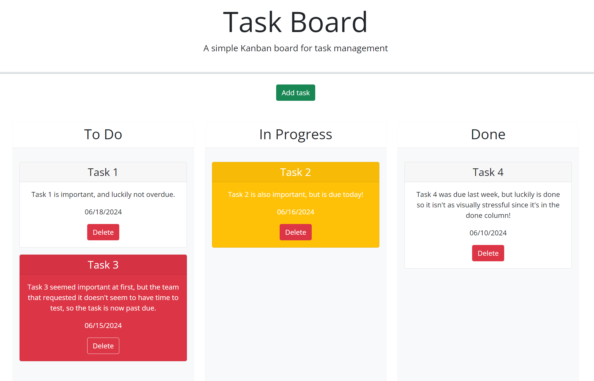

# Task Board Starter Code

## Description

Joyful Noise music production company reached out to me requesting a Task Board web app to help them manage their projects. Being able to have a visual representation of their tasks that they can access anywhere would prove to be very valuable to them and improve communication across teams.

## Installation

NA

## Usage

When a user loads the page it'll display any tasks they've saved since their last visit, and let's them create more tasks when they click the "Add task" button. When they click the green "Add task" button a modal form appears and prompts the user to enter the tasks title, due date, and description. Once the user enters the information and hits "Save Task" a new task card appears in the To-Do column, and the user can move the task cards to whichever column matches the current status of the task. Once a user is done with a task they can click the red "Delete" button to remove it from the task board.

Here's a link to the [Task Board](https://horizonbound0.github.io/KW05-Joyful-Noise-Project-Manager/)

## Credits

I learned how to reset form input values from [GeeksForGeeks.org](https://www.geeksforgeeks.org/how-to-reset-a-form-using-jquery-with-reset-method/)

Also, the mini project for Week 5 was CRUCIAL to understanding how to get this task board working, and I have a personal branch from the gitlab I can produce upon request.

## License

This project uses the MIT license, which is available to read in the repository.